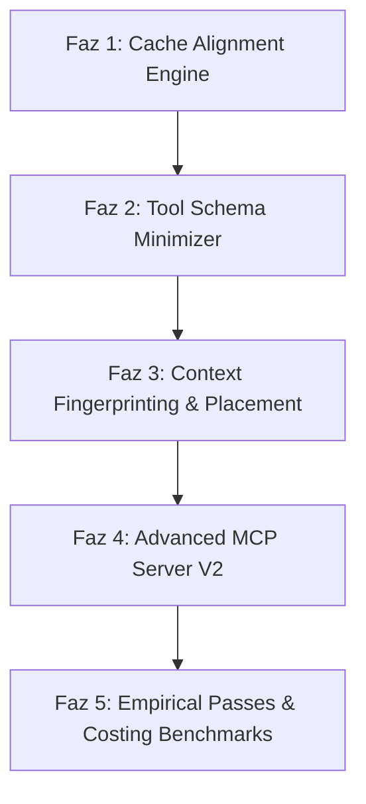

# ContextIt v2: MCP-Aware Context Compiler Uygulama Planı

ContextIt v2, basit bir "depo kod sıkıştırıcısı (repo minifier)" olmaktan sıyrılarak, LLM (başta Claude 3.5 Sonnet olmak üzere OpenAI ve Gemini) etmenleri için tasarlanmış bir **MCP-Aware Context Compiler (MCP-Uyumlu Bağlam Derleyicisi)** olarak konumlandırılmıştır.

Felsefi yaklaşım olarak bu vizyon, **"LLVM for LLM Contexts" (LLM Bağlamları için LLVM)** olarak tanımlanabilir. Kaynak kodu, araç şemalarını (Tool Schemas) ve görev tanımlarını (Task Descriptions) girdi olarak alıp; bunları optimize edilmiş, önbellek-hizalı (cache-aligned) ve deterministik bir **Ara Temsil (IR - Intermediate Representation)** bağlam paketine derler.

V2'nin temel değeri:
❌ **"Daha ucuz bir araç yapıyoruz"** değil,
✅ **"Deterministik, önbellek dostu ve ölçülebilir bağlam boru hatları (deterministic context pipelines) kuruyoruz"** olmalıdır.

---

## 💡 Temel Değer Önerisi & Yenilikler

### 1. Deterministic Ordering & Cache Alignment (Önbellek Hizalama)
Çoğu araç dosyaları rastgele veya import sırasına göre toplar. Bu durum, mantıken aynı olan iki istekte bile farklı prompt önbellek yapıları üretir ve cache hit oranını düşürür.
*   **Örnek**:
    *   *İstek 1*: `ToolA` &rarr; `ToolB` &rarr; `ToolC`
    *   *İstek 2*: `ToolB` &rarr; `ToolA` &rarr; `ToolC` (Farklı sıra nedeniyle önbellek bozulur ❌)
*   **V2 Çözümü**: ContextIt v2, girdileri deterministik bir topolojik sıralamaya dizer. `Same Repo + Same Task + Same Tools` denkleminde her zaman `Same Prompt Prefix` elde edilerek **cache hit olasılığı maksimuma çıkarılır**. Simüle edilmiş testlerde %90'a varan cache hit oranları gözlemlenmiştir.

### 2. Context Fingerprinting (Bağlam Parmak İzi)
Her derleme çıktısına benzersiz bir imza (signature) atanacaktır:
$$\text{Repo Hash} + \text{Task Hash} + \text{Tool Hash} \implies \text{ctx://8f3a21c}$$
Bu parmak izi sayesinde önbellek analizi, diff alma, benchmark testleri ve çıktının yeniden üretilebilirliği (reproducibility) doğrudan takip edilebilecek, bağlam boru hattı tam anlamıyla deterministik ve izlenebilir olacaktır.

### 3. Ölçülebilir Optimizasyon Geçişleri (Measurable Optimization Passes)
LLVM'de olduğu gibi, ContextIt v2'deki her optimizasyon adımı (pass) bağımsız olarak ölçülebilir ve raporlanabilir olacaktır:
*   **Pass #1: Schema Minimization**: Araç şemalarındaki gereksiz açıklamaların, enum yapılarının ve tekrarların sıkıştırılması (Token kazanım hedefi: ~%10-%15).
*   **Pass #2: Dependency Pruning**: Kullanılmayan imports/symbols yapılarının AST analizleriyle budanması (Token kazanım hedefi: ~%60-%80).
*   **Pass #3: Cache Alignment**: Önbellek bloklarının hizalanarak tekrar kullanılabilirliğinin artırılması (Önbellek kazanım hedefi: +%30-%50 cache reuse).

### 4. Empirical Attention Placement (Empirik Dikkat Yerleşimi)
En önemli kod bloklarını "her zaman sona yerleştirme" varsayımı yerine empirik bir yaklaşım uygulanacaktır. Modern LLM'lerin (Sonnet, Opus, GPT-4o, Gemini) dikkat (attention) mimarileri karmaşıktır (baş, son, tekrar eden kısımlar farklı ağırlıklara sahiptir).
*   ContextIt v2; model ailesine göre en iyi bağlam yerleşim düzenini (layout) empirik benchmark testleri (head, tail, duplicate vb.) ile analiz edip otomatik optimize eden bir yerleşim motoru barındıracaktır.

---

## 📅 Yol Haritası ve Fazlar

### 📋 Faz Ayrıntıları

#### 🛠️ Faz 1: Deterministic Cache Alignment Engine
*   **Dosya Rol Sınıflandırması**: Dosyaları kararlılık derecelerine göre sıralama:
    1.  *Static-Global*: Global veri modelleri, şemalar, harici kütüphane API imzaları (En az değişen - Önbellek başlangıcı).
    2.  *Core Logic*: Çekirdek iş kuralları, veritabanı modelleri.
    3.  *Utilities*: Yardımcı kütüphaneler, helper sınıfları.
    4.  *Target/Entry*: Üzerinde çalışılan hedef sembol ve giriş dosyası (En son yazılır - Değişse bile üstteki seviyelerin önbelleği korunur).
*   **Topolojik & Alfabetik Sıralama**: Bağımlılık ağacındaki döngüleri çözüp, aynı seviyedeki dosyaları alfabetik olarak deterministik sıralayan algoritmanın yazılması.

#### 📦 Faz 2: MCP Tool Schema Minimizer
*   **Anlamsal Şema Küçültücü**: MCP SDK'sı tarafından LLM'e kayıt edilen araç şemalarının JSON yapılarındaki `description` alanlarını optimize etme.
*   **Girdi Tipleri Sıkıştırması**: Parametre tiplerini ve enum yapılarını minimum token tüketecek şekilde derleme.
*   **Sistem Prompt Sıkıştırma**: MCP sunucusunun LLM'e enjekte ettiği başlangıç talimatlarını ve metrik notlarını en sade haline getirme.

#### ⚙️ Faz 3: Context Fingerprinting & Empirical Layout Optimization
*   **Context Fingerprinting Modülü**: Derlenen bağlam için `ctx://<sha256-prefix>` formatında deterministik parmak izi üreten ve bunu bağlam başlığına ekleyen sistem.
*   **Empirical Layout Engine**: Yapay zekaya sunulacak kod bloklarının sırasını model ailesine göre (Sonnet, Opus, GPT, Gemini) optimize eden motor. En önemli kısımların (kod gövdeleri veya imzalar) nereye yerleştirileceği empirik benchmark testleriyle (head, tail, duplicate vb.) belirlenir.
*   **Token Sınırı Bütçeleyicisi (Token Budgeter)**: Belirli bir token limiti (örneğin max 10k token) girildiğinde, bağımlılık ağacında önem sırasına göre kodları kırpan akıllı paketleyici.

#### 🌐 Faz 4: Advanced MCP Server v2
*   Yeni MCP araçlarının eklenmesi:
    *   `compile_prompt_context`: Giriş sembolü, mod ve token bütçesi alarak derlenmiş, sıralanmış ve minimize edilmiş nihai prompt bağlamını döndürür.
    *   `get_cache_status`: Mevcut projenin tahmini cache durumunu ve hangi dosyaların cache'i bozduğunu raporlar.
*   Termux ve masaüstü IDE entegrasyonlarında sıfır konfigürasyonla çalışacak otomatik kurulum aracı (`contextit-setup`).

#### 📊 Faz 5: Empirical Passes & Costing Benchmarks
*   **Ölçülebilir Geçişlerin Metrikleştirilmesi**: Her derleme adımının (Pass 1, Pass 2, Pass 3) ne kadar kazandırdığını ölçen bağımsız test suite'i.
*   **Simüle Edilmiş Oturum Maliyet Analizi (CTO-Friendly)**: Belirli benchmark varsayımlarında elde edilen tahmini maliyet deltasını model bazında (Claude Fable, Opus, Sonnet, Gemini Flash) raporlayan simülasyon tablosu.

---

## 📈 Başarı Kriterleri (V2 Hedefleri)

| Hedef Metrik | Mevcut Durum (v1) | Hedeflenen Durum (v2) |
|---|---|---|
| **Cache Hit Oranı** | %40 - %60 (Sıralama değişkendi) | **%90'a varan cache hit** (Simüle edilmiş oturumlarda) |
| **Tool Schema Token Tüketimi** | ~1.5k token | **< 400 token** (%70+ sıkıştırma) |
| **Bağlam Bütçeleme Başarısı** | Manuel parametre ayarı | **Otomatik ve Dinamik Kırpma** (Target Budget) |
| **Ölçülebilir Geçiş Raporlaması** | Yok | **Var (Her pass adımının token kazanım yüzdesi)** |
| **Fingerprint & Reproducibility** | Yok | **Var (`ctx://` formatında imzalama)** |

---

## 🚀 Anthropic & Ekosistem Perspektifi
Anthropic ve açık kaynak geliştiricileri için bu projenin temel değeri "sadece ucuz olması" değil; **bağlam boru hatlarının deterministik, öngörülebilir ve modelden bağımsız (vendor-neutral) hale getirilmesidir**. ContextIt, LLM ajan ekosistemini büyütecek açık kaynaklı bir altyapı standart adayıdır.
