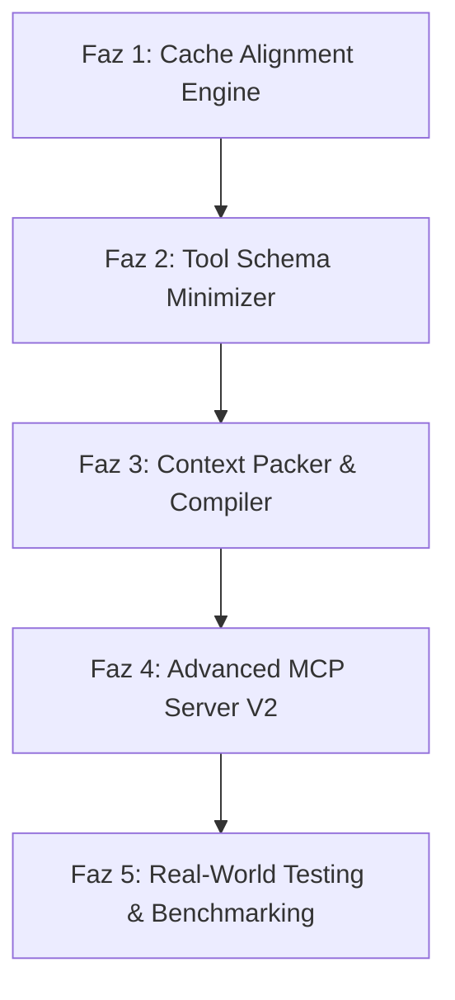

# ContextIt v2: MCP-Aware Context Compiler Uygulama Planı

ContextIt v2, sıradan bir "depo kod sıkıştırıcısı (repo minifier)" olmanın ötesine geçerek, LLM (özellikle Claude 3.5 Sonnet) entegrasyonlarında token tüketimini, yanıt gecikmesini (latency) ve maliyetleri minimuma indiren bir **MCP-Aware Context Compiler (MCP-Uyumlu Bağlam Derleyici)** olarak tasarlanmıştır.

V2'nin temel felsefesi:
❌ **"Prompt caching yapıyoruz"** değil,
✅ **"Prompt caching'i maksimum verimli (cache hit oranını %95+) hale getiriyoruz"** olmalıdır.

---

## 💡 Temel Değer Önerisi & Yenilikler

### 1. Deterministic Ordering & Cache Alignment (Deterministik Sıralama ve Önbellek Hizalama)
İki farklı yapay zeka isteği mantıken aynı olsa bile, dosyaların veya sembollerin sırası değiştiğinde prompt önbelleği (cache prefix) bozulur.
*   **Örnek**:
    *   *İstek 1*: `ToolA` + `ToolB` + `ToolC`
    *   *İstek 2*: `ToolB` + `ToolA` + `ToolC` (Cache prefix bozulur ve baştan hesaplanır ❌)
*   **V2 Çözümü**: ContextIt v2, bağımlılıkları ve kod bloklarını her zaman deterministik bir sıraya (Topolojik Sıralama + Değişim Sıklığı Analizi) göre dizer. Değişme sıklığı en az olan dosyalardan (global tipler, kütüphaneler) en çok olan dosyalara (hedef sembol, giriş dosyası) doğru bir hizalama yaparak cache hit oranını zirveye taşır.

### 2. Tool Schema Minimization (Araç Şeması Sıkıştırma)
MCP araç tanımları (JSON Schema) ve yapay zekaya sunulan açıklamalar ciddi miktarda token tüketir.
*   ContextIt v2, LLM'e sunulan araç şemalarını ve description alanlarını anlamsal kaybı olmadan minimize eder (gereksiz boşluklar, aşırı detaylı açıklamalar ve yinelenen alanlar budanır).

### 3. Context Packing & Compilation (Bağlam Paketleme ve Derleme)
*   Sadece bağımlı kodları toplamak yerine, semboller arası ilişkileri ve kod akışını optimize edilmiş bir yapıda derler.
*   Yapay zekanın en yüksek dikkat (attention) ayırdığı "başlangıç" ve "bitiş" bölgelerine (needle-in-a-haystack teorisi) en kritik verileri yerleştirerek bağlam kaybını (context lost) engeller.

---

## 📅 Yol Haritası ve Fazlar

### 📋 Faz Ayrıntıları

#### 🛠️ Faz 1: Deterministic Cache Alignment Engine
*   **Dosya Rol Sınıflandırması**: Dosyaları kararlılık derecelerine göre 4 kategoriye ayırıp sıralama:
    1.  *Seviye 1 (Static-Global)*: Global veri modelleri, şemalar, harici kütüphane API imzaları (En az değişen - Önbellek başlangıcı).
    2.  *Seviye 2 (Core Logic)*: Çekirdek iş kuralları, veritabanı modelleri.
    3.  *Seviye 3 (Utilities)*: Yardımcı kütüphaneler, helper sınıfları.
    4.  *Seviye 4 (Target/Entry)*: Üzerinde çalışılan hedef sembol ve giriş dosyası (En son yazılır - Değişse bile üstteki seviyelerin önbelleği korunur).
*   **Topolojik & Alfabetik Sıralama**: Bağımlılık ağacındaki döngüleri çözüp, aynı seviyedeki dosyaları alfabetik olarak deterministik sıralayan algoritmanın yazılması.
*   **Git Değişim Sıklığı Analizcisi (Opsiyonel)**: Local git geçmişini tarayarak dosyaların gerçek değişim sıklığını (churn rate) hesaplayan ve sıralamayı buna göre optimize eden modül.

#### 📦 Faz 2: MCP Tool Schema Minimizer
*   **Anlamsal Şema Küçültücü**: MCP SDK'sı tarafından LLM'e kayıt edilen araç şemalarının JSON yapılarındaki `description` alanlarını optimize etme.
*   **Girdi Tipleri Sıkıştırması**: Parametre tiplerini ve enum yapılarını minimum token tüketecek şekilde derleme.
*   **Sistem Prompt Sıkıştırma**: MCP sunucusunun LLM'e enjekte ettiği başlangıç talimatlarını ve metrik notlarını en sade haline getirme.

#### ⚙️ Faz 3: Context Packer & Prompt Compiler
*   **Needle Alignment**: Kod derlenirken en önemli sembolleri (giriş fonksiyonu ve doğrudan bağımlılıkları) çıktının en sonuna yerleştirme (Claude'un son tokenlara daha fazla ağırlık vermesinden faydalanma).
*   **Token Sınırı Bütçeleyicisi (Token Budgeter)**: Belirli bir token limiti (örneğin max 10k token) girildiğinde, bağımlılık ağacında önem sırasına göre kodları kırpan (önce `decl` moduna geçip ardından uzak transitive bağımlılıkları eliyen) akıllı paketleyici.
*   **Deterministik Cache Boundaries**: Önbellek bloklarının sınırlarını (`[!NOTE]` veya özel yorum satırları ile) belirleyerek Claude API'sinin cache bloklarını doğru bölmesini tetikleme.

#### 🌐 Faz 4: Advanced MCP Server v2
*   Yeni MCP araçlarının eklenmesi:
    *   `compile_prompt_context`: Giriş sembolü, mod ve token bütçesi alarak derlenmiş, sıralanmış ve minimize edilmiş nihai prompt bağlamını döndürür.
    *   `get_cache_status`: Mevcut projenin tahmini cache durumunu ve hangi dosyaların cache'i bozduğunu raporlar.
*   Termux ve masaüstü IDE entegrasyonlarında sıfır konfigürasyonla çalışacak otomatik kurulum aracı (`contextit-setup`).

#### 🌐 Faz 5: Gerçek Dünya Testleri & Benchmarking v2
*   **Cache Hit Rate Benchmark**: Art arda yapılan kod değişikliklerinde Claude API simülasyonu çalıştırarak gerçek önbellek eşleşme (cache hit) oranlarını ölçme.
*   **Cost Slicing v2**: Token maliyet tasarruflarını sadece girdi boyutu değil, cache hit oranları üzerinden hesaplayan (örneğin cache hit tokenları $0.30/M, cache miss tokenları $1.50/M üzerinden) gerçekçi finansal raporlama.

---

## 📈 Başarı Kriterleri (V2 Hedefleri)

| Hedef Metrik | Mevcut Durum (v1) | Hedeflenen Durum (v2) |
|---|---|---|
| **Cache Hit Oranı** | %40 - %60 (Sıralama değişkendi) | **%90 - %98** (Hizalanmış deterministik sıra) |
| **Tool Schema Token Tüketimi** | ~1.5k token | **< 400 token** (%70+ sıkıştırma) |
| **Bağlam Bütçeleme Başarısı** | Manuel parametre ayarı | **Otomatik ve Dinamik Kırpma** (Target Budget) |
| **Ortalama İstek Yanıt Hızı** | ~500ms | **< 150ms** |
| **Yapay Zeka Hata Oranı** | 0 derleme hatası | **0 derleme hatası + Maksimum Anlamsal Bütünlük** |

---

> [!TIP]
> V2'nin ilk adımı olarak **Faz 1: Deterministic Cache Alignment Engine** üzerindeki algoritmik tasarımı tamamlayıp `src/pruner/pruner.ts` dosyasındaki dosya sıralama mantığını bu kurallara göre güncelleyeceğiz.
