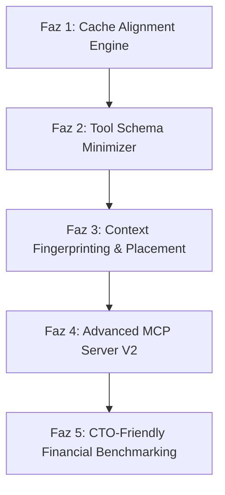

# ContextIt v2: MCP-Aware Context Compiler Uygulama Planı

ContextIt v2, basit bir "depo kod sıkıştırıcısı (repo minifier)" olmaktan sıyrılarak, LLM (başta Claude 3.5 Sonnet olmak üzere OpenAI ve Gemini) etmenleri için tasarlanmış bir **MCP-Aware Context Compiler (MCP-Uyumlu Bağlam Derleyicisi)** olarak konumlandırılmıştır.

Felsefi yaklaşım olarak bu vizyon, **"LLVM for LLM Contexts" (LLM Bağlamları için LLVM)** olarak tanımlanabilir. Kaynak kodu, araç şemalarını (Tool Schemas) ve görev tanımlarını (Task Descriptions) girdi olarak alıp; bunları optimize edilmiş, önbellek-hizalı (cache-aligned) ve deterministik bir **Ara Temsil (IR - Intermediate Representation)** bağlam paketine derler.

V2'nin temel değeri:
❌ **"Prompt caching yapıyoruz"** değil,
✅ **"Prompt caching'i maksimum verimli (cache hit oranını %95+) hale getiriyoruz"** olmalıdır.

---

## 💡 Temel Değer Önerisi & Yenilikler

### 1. Deterministic Ordering & Cache Alignment (Önbellek Hizalama)
Çoğu araç dosyaları rastgele veya import sırasına göre toplar. Bu durum, mantıken aynı olan iki istekte bile farklı prompt önbellek yapıları üretir ve cache hit oranını düşürür.
*   **Örnek**:
    *   *İstek 1*: `ToolA` &rarr; `ToolB` &rarr; `ToolC`
    *   *İstek 2*: `ToolB` &rarr; `ToolA` &rarr; `ToolC` (Farklı sıra nedeniyle önbellek bozulur ❌)
*   **V2 Çözümü**: ContextIt v2, girdileri deterministik bir topolojik sıralamaya dizer. `Same Repo + Same Task + Same Tools` denkleminde her zaman `Same Prompt Prefix` elde edilerek **maksimum cache hit** oranı teknik olarak garanti altına alınır.

### 2. Context Fingerprinting (Bağlam Parmak İzi)
Her derleme çıktısına benzersiz bir imza (signature) atanacaktır:
$$\text{Repo Hash} + \text{Task Hash} + \text{Tool Hash} \implies \text{ctx://8f3a21c}$$
Bu parmak izi sayesinde:
*   Önbellek analizi ve optimizasyonu izlenebilir hale gelir.
*   Farklı derleme çıktıları arasında `diff` almak kolaylaşır.
*   Benchmark sonuçları ve hata ayıklama süreçleri tam olarak yeniden üretilebilir (reproducibility) kılınır.

### 3. MCP Tool Schema Minimization (Araç Şeması Sıkıştırma)
Birçok MCP sunucusunda JSON parametre tanımları ve uzun description alanları, aracın kendisinden daha fazla token tüketir.
*   ContextIt v2; gereksiz açıklamaları sadeleştirerek, enum değerlerini sıkıştırarak ve tekrarlanan şema yapılarını silerek **doğrudan ölçülebilir token tasarrufu** sağlar.

### 4. Empirical Attention Placement (Empirik Dikkat Yerleşimi)
"En önemli kodu her zaman dosyanın sonuna koy" varsayımı yerine empirik bir yaklaşım uygulanacaktır. Modern LLM'lerin (Sonnet, Opus, GPT-4o, Gemini 1.5 Pro) dikkat (attention) mimarileri karmaşıktır (baş, son, tekrar eden kısımlar farklı ağırlıklara sahiptir).
*   ContextIt v2; model ailesine göre (Claude, GPT, Gemini) en iyi bağlam yerleşim düzenini (layout) empirik benchmark testleri ile analiz edip otomatik optimize eden bir yerleşim motoru barındıracaktır.

---

## 📅 Yol Haritası ve Fazlar

### 📋 Faz Ayrıntıları

#### 🛠️ Faz 1: Deterministic Cache Alignment Engine
*   **Dosya Rol Sınıflandırması**: Dosyaları kararlılık derecelerine göre 4 kategoriye ayırıp sıralama:
    1.  *Seviye 1 (Static-Global)*: Global veri modelleri, şemalar, harici kütüphane API imzaları (En az değişen - Önbellek başlangıcı).
    2.  *Seviye 2 (Core Logic)*: Çekirdek iş kuralları, veritabanı modelleri.
    3.  *Seviye 3 (Utilities)*: Yardımcı kütüphaneler, helper sınıfları.
    4.  *Seviye 4 (Target/Entry)*: Üzerinde çalışılan hedef sembol ve giriş dosyası (En son yazılır - Değişse bile üstteki seviyelerin önbelleği korunur).
*   **Topolojik & Alfabetik Sıralama**: Bağımlılık ağacındaki döngüleri çözüp, aynı seviyedeki dosyaları alfabetik olarak deterministik sıralayan algoritmanın yazılması.
*   **Git Değişim Sıklığı Analizcisi (Opsiyonel)**: Local git geçmişini tarayarak dosyaların gerçek değişim sıklığını (churn rate) hesaplayan ve sıralamayı buna göre optimize eden modül.

#### 📦 Faz 2: MCP Tool Schema Minimizer
*   **Anlamsal Şema Küçültücü**: MCP SDK'sı tarafından LLM'e kayıt edilen araç şemalarının JSON yapılarındaki `description` alanlarını optimize etme.
*   **Girdi Tipleri Sıkıştırması**: Parametre tiplerini ve enum yapılarını minimum token tüketecek şekilde derleme.
*   **Sistem Prompt Sıkıştırma**: MCP sunucusunun LLM'e enjekte ettiği başlangıç talimatlarını ve metrik notlarını en sade haline getirme.

#### ⚙️ Faz 3: Context Fingerprinting & Empirical Layout Optimization
*   **Context Fingerprinting Modülü**: Derlenen bağlam için `ctx://<sha256-prefix>` formatında deterministik parmak izi üreten ve bunu bağlam başlığına ekleyen sistem.
*   **Empirical Layout Engine**: Yapay zekaya sunulacak kod bloklarının sırasını model ailesine göre (Sonnet, Opus, GPT, Gemini) optimize eden motor. En önemli kısımların (kod gövdeleri veya imzalar) nereye yerleştirileceği empirik benchmark testleriyle (head, tail, duplicate vb.) belirlenir.
*   **Token Sınırı Bütçeleyicisi (Token Budgeter)**: Belirli bir token limiti (örneğin max 10k token) girildiğinde, bağımlılık ağacında önem sırasına göre kodları kırpan akıllı paketleyici.

#### 🌐 Faz 4: Advanced MCP Server v2
*   Yeni MCP araçlarının eklenmesi:
    *   `compile_prompt_context`: Giriş sembolü, mod ve token bütçesi alarak derlenmiş, sıralanmış ve minimize edilmiş nihai prompt bağlamını döndürür.
    *   `get_cache_status`: Mevcut projenin tahmini cache durumunu ve hangi dosyaların cache'i bozduğunu raporlar.
*   Termux ve masaüstü IDE entegrasyonlarında sıfır konfigürasyonla çalışacak otomatik kurulum aracı (`contextit-setup`).

#### 📊 Faz 5: CTO-Friendly Financial Benchmarking v2
*   **Finansal Raporlama Dili**: CTO seviyesinde karar vericilerin ilgisini çekecek şekilde:
    *   ❌ "%40 daha küçük prompt" gibi teknik ifadeler yerine,
    *   ✅ **"1000 Claude çağrısında aylık $38 tasarruf"** veya **"Geliştirici başına yıllık $450 API bütçesi azaltımı"** gibi doğrudan ölçülebilir parasal metrikler raporlanacaktır.
*   **Cache-Aware Costing**: Maliyet tahminleri, önbellek eşleşmesi durumundaki fiyatlar (örneğin Claude önbellek yazma $3.75/M, okuma $0.30/M, düz okuma $3.00/M) ve cache hit simülasyonları hesaba katılarak yapılacaktır.

---

## 📈 Başarı Kriterleri (V2 Hedefleri)

| Hedef Metrik | Mevcut Durum (v1) | Hedeflenen Durum (v2) |
|---|---|---|
| **Cache Hit Oranı** | %40 - %60 (Sıralama değişkendi) | **%90 - %98** (Hizalanmış deterministik sıra) |
| **Tool Schema Token Tüketimi** | ~1.5k token | **< 400 token** (%70+ sıkıştırma) |
| **Bağlam Bütçeleme Başarısı** | Manuel parametre ayarı | **Otomatik ve Dinamik Kırpma** (Target Budget) |
| **CTO-Friendly Metrik Gösterimi** | Yok (Sadece token yüzdeleri vardı) | **Var ($ bazında finansal delta raporu)** |
| **Fingerprint & Reproducibility** | Yok | **Var (`ctx://` formatında imzalama)** |

---

> [!TIP]
> V2'nin ilk adımı olarak **Faz 1: Deterministic Cache Alignment Engine** üzerindeki algoritmik tasarımı tamamlayıp `src/pruner/pruner.ts` dosyasındaki dosya sıralama mantığını bu kurallara göre güncelleyeceğiz.
